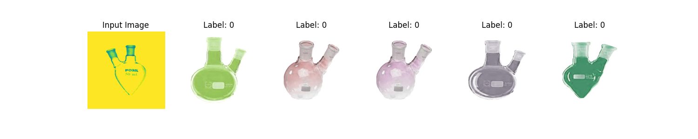
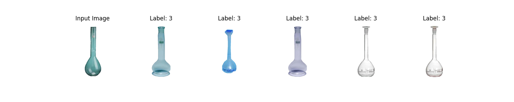
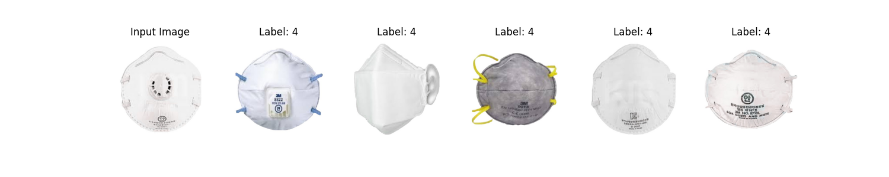
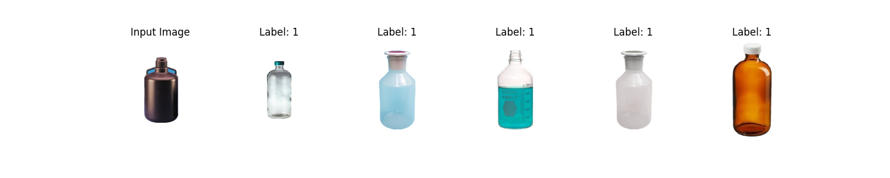
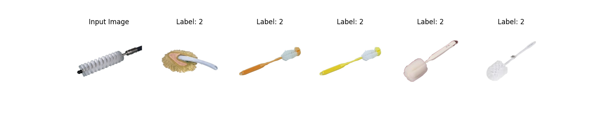
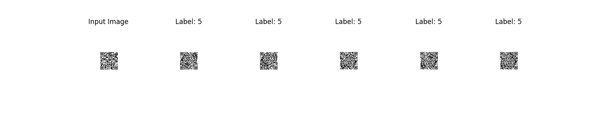

# Faiss-Image-Relation

This is an example source of related image detection using faiss.

Faiss is an efficient and high-performance library for similarity search and clustering tasks in large datasets. It is commonly used for tasks such as nearest neighbor search and similarity-based retrieval. The name "Faiss" stands for "Facebook AI Similarity Search."

Meta Git : https://github.com/facebookresearch/faiss

## Introduce

### train.py

This code trains a custom MobileNetV2 model for image classification, saving the trained model's weights and extracting feature vectors from the model for future use.

### run.py

This code extracts image embeddings using a MobileNetV2 model, builds a Faiss index for image retrieval, and demonstrates two examples:

1) Searching for similar images to a specific image from the dataset
2) Searching for similar images to a new input image.

## Install

### make venv and connect

```terminal
python -m venv venv
.\venv\Scripts\activate
```

### faiss install

```terminal
pip install faiss-cpu
```

### pytorch install

```terminal
pip3 install torch==1.12.1+cu113 torchvision==0.13.1+cu113 torchaudio===0.12.1+cu113 -f https://download.pytorch.org/whl/torch_stable.html
```

### requirement install

```terminal
pip install -r requirements.txt
```

## Result







